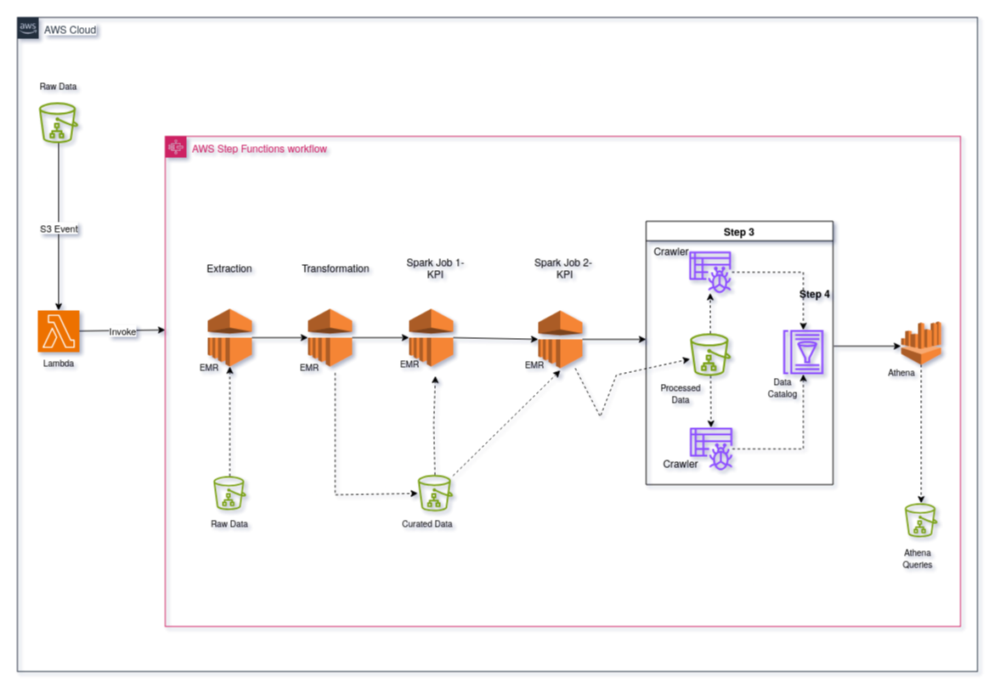
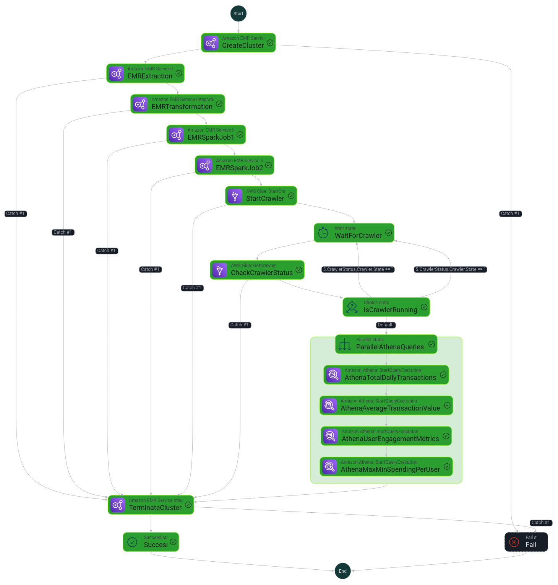
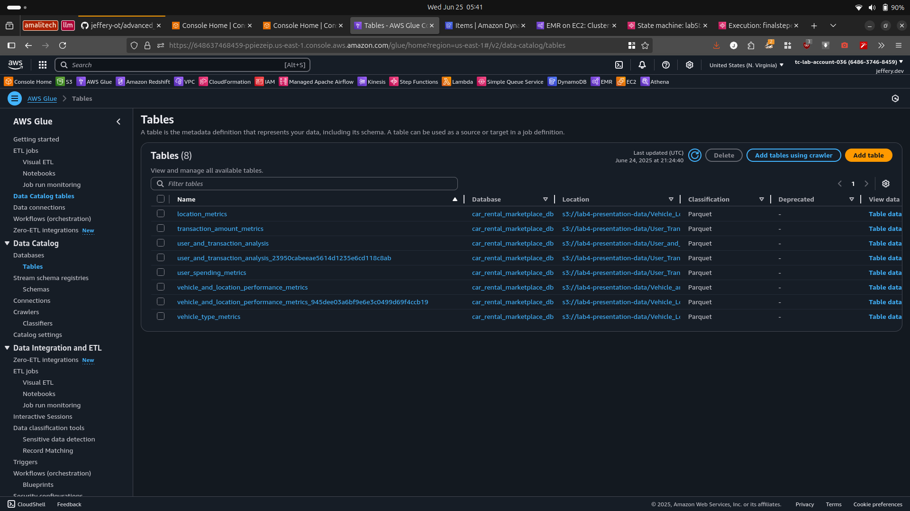

## Big Data Processing with EMR

#### Data Architecture



#### Step Function - State Machine



# EMR Data Pipeline - Car Rental Marketplace Analytics

A robust, serverless data pipeline built on AWS that processes car rental marketplace data through automated ETL workflows using EMR, Glue, and Athena services.

## Architecture Overview

The pipeline implements a modern data lakehouse architecture with three distinct layers:

- **Raw Layer**: Initial data ingestion from source systems
- **Curated Layer**: Cleaned and validated datasets ready for analysis
- **Presentation Layer**: Business-ready analytical datasets and KPIs

## Pipeline Components

### 1. AWS Step Functions Orchestrator
The main orchestration engine that manages the entire pipeline workflow:
- Creates EMR cluster dynamically
- Executes data processing jobs sequentially
- Runs Glue crawlers for schema discovery
- Performs parallel Athena queries
- Terminates cluster automatically for cost optimization

### 2. Data Processing Scripts

#### **Transformation Script** (`transformation.py`)
- Processes raw CSV data from S3 into curated Parquet format
- Handles four core datasets: locations, rental transactions, users, and vehicles
- Implements data quality checks and null value removal
- Provides comprehensive S3 logging for monitoring

#### **Spark Job 1** (`spark_job_1.py`) - Vehicle & Location Analytics
- Creates presentation-ready datasets for vehicle and location performance
- Computes location-based KPIs (revenue, transaction volume, averages)
- Generates vehicle type performance metrics
- Organizes data for optimal query performance

#### **Spark Job 2** (`spark_job_2.py`) - User & Transaction Analytics
- Processes user behavior and transaction patterns
- Calculates daily transaction metrics and revenue trends
- Analyzes user spending patterns and rental duration metrics
- Provides comprehensive transaction amount analytics

### 3. Data Flow

```
Raw Data (CSV) → EMR Extraction → EMR Transformation → Curated Data (Parquet) → EMR Spark Jobs → Presentation Layer → Athena Queries
```

## Key Features

- **Dynamic Cluster Management**: EMR clusters are created and terminated automatically
- **Fault Tolerance**: Built-in retry mechanisms and error handling
- **Cost Optimization**: Resources are provisioned only when needed
- **Comprehensive Logging**: Detailed S3 logging for all operations
- **Data Quality**: Automated data cleaning and validation
- **Scalability**: Configurable instance types and cluster sizing

## Output Analytics

### Vehicle & Location Performance
- Revenue per location and vehicle type
- Transaction volume analysis
- Average transaction amounts
- Unique vehicle utilization metrics

### User & Transaction Analysis
- Daily revenue and transaction trends
- User spending behavior patterns
- Rental duration analytics
- Transaction amount distributions

### Athena Query Capabilities
- Total daily transactions and revenue
- Average transaction values
- User engagement metrics
- Min/max spending analysis per user

## Infrastructure Requirements

- **EMR Cluster**: m5.xlarge instances (1 master, 1 core node)
- **S3 Buckets**: 
  - Raw data storage
  - Curated data lake
  - Presentation layer
  - Logging and archival
- **Glue Catalog**: Automated schema discovery and metadata management
- **Athena**: Interactive query engine for business intelligence

## Configuration

The pipeline supports configurable parameters:
- EMR cluster specifications
- S3 bucket locations
- Retry policies and error handling
- Data quality thresholds

## Monitoring & Observability

- Comprehensive S3 logging with timestamps and context
- Step Functions visual workflow monitoring
- EMR cluster metrics and job tracking
- Athena query performance monitoring

## Cost Optimization Features

- Automatic cluster termination after job completion
- Parquet format for storage efficiency
- Data partitioning and compression
- Resource allocation based on workload requirements

This pipeline provides a complete solution for processing car rental marketplace data, from raw ingestion through business-ready analytics, with enterprise-grade reliability and cost optimization.


#### Glue Tables




